# 扩大 `scheduler pool` region CPU 统计范围后的跨仓库影响分析

本文结合以下三个仓库做静态代码分析：

- `~/tikv`
- `~/pd`
- `~/tidb`

目标问题是：

> 如果我们把 TiKV 的 `scheduler pool` CPU 更完整地计入当前 `region CPU`，会不会影响其他模块，尤其是 `resource control`？

这里讨论的“扩大统计范围”，指的是前面那套 patch 思路：

- Patch A：把 txn scheduler 的 tag attach 从 `process()` 前移到 `execute()`
- Patch B：给 `fail_fast_or_check_deadline()` 的 scheduler future 也打 tag
- Patch C：给 `sched_raw_command()` 里的 raw scheduler future 打 tag

本文默认：

- **不改** `ResourceControlContext`
- **不改** TiDB 发下来的 `resource_group_tag`
- **不改** PD / TiKV 的协议字段
- **只改** TiKV 侧“哪些 CPU 会被归到当前 region”

## 一句话结论

### 结论 1：对 `resource control` 的协议和调度语义，基本没有直接影响

原因是：

- `resource control` 看的不是 region heartbeat 里的 `cpu_usage`
- 它看的主要是：
  - 请求上的 `ResourceControlContext`
  - TiKV 本地 `ControlledFuture` 记下的 poll CPU
  - TiKV 向 PD resource manager 上报的 `ConsumptionSinceLastRequest`

而这些链路与“region CPU 是否把 scheduler 前半段记进去”不是同一套数据。

### 结论 2：真正会被改变的，是 `region CPU` 的语义和对外展示

扩大 `scheduler pool` 覆盖后：

- TiKV 本地 `region CPU` 会变大；
- PD 收到的 `RegionHeartbeat.cpu_usage` 会变大；
- PD 的 region API / `/regions/cpu` 排行会变；
- 但 **PD 热点调度和 TiDB 资源控制主流程，代码上看都不会直接跟着变。**

### 结论 3：最需要小心的是 Patch C 的实现细节

Patch A/B 风险相对低。

Patch C 如果只是给 raw scheduler future 包一层 `in_resource_metering_tag(...)`，通常没有跨仓库副作用。

但如果顺手把 `sched_raw_command()` 的 `request_source` 从 `""` 改成真实值，或者把线程池名塞进 `resource_group_tag` / `extra_attachment`，那就可能改变：

- TiKV 本地 background resource control 行为；
- resource metering 的 tag 基数与上报聚合行为。

所以 Patch C 要做“最小语义改动版”。

## 影响总表

| 模块 | 是否会受影响 | 影响程度 | 原因 |
|---|---|---|---|
| TiKV `resource_metering -> region CPU` | 会 | 高 | 这是改动目标本身 |
| TiKV 本地 `resource control` 调度/限流 | 基本不会 | 低 | 仍按 `ControlledFuture` + `TaskMetadata` + `ResourceControlContext` 工作 |
| TiKV 向 PD 上报的 `RegionHeartbeat.cpu_usage` | 会 | 中 | 更大的 scheduler CPU 会进入 `cpu_stats.unified_read` |
| PD `region` API / `/regions/cpu` | 会 | 中 | PD 直接把 heartbeat CPU 放进 `RegionInfo.cpuUsage` 并用于排序 |
| PD hot-region 调度 | 基本不会 | 低 | hot-region 维度只有 bytes/keys/query，没有 CPU 维度 |
| PD store CPU 统计 | 不会 | 低 | store CPU 来自 `StoreStats.cpu_usages`，不是 region heartbeat CPU |
| PD resource manager / RU accounting | 基本不会 | 低 | 它消费的是 `ConsumptionSinceLastRequest`，不是 region heartbeat |
| TiDB request resource control | 基本不会 | 低 | TiDB 依赖 `ResourceControlContext`、`ResourceGroupTag`、RU token bucket |
| TiDB `Tikv_cpu_time` / RU 统计 | 基本不会 | 低 | TiDB 用的是响应里的 `TimeDetail.ProcessTime` / RU consumption，不是 heartbeat CPU |
| 外部依赖 PD region CPU API 的人工排障脚本 | 会 | 中 | `cpu_usage` 语义会从“偏 unified-read”变成“更混合的 scheduler CPU” |

## 1. TiKV 本地：为什么 `resource control` 基本不受影响

### 1.1 `scheduler pool` 的 resource control 本来就包在 future 外层

在 `SchedPool` 的 priority queue 中，future 会先进入：

- `ControlledFuture::new(f, self.resource_ctl.clone(), group_name)`
- 再经过 `with_resource_limiter(...)`

代码：

- `src/storage/txn/sched_pool.rs:128`
- `src/storage/txn/sched_pool.rs:136`
- `components/resource_control/src/future.rs:42`

`ControlledFuture` 的逻辑是：

- poll inner future；
- 统计这次 poll 花掉的 CPU 时间；
- 记到 resource controller。

代码：

- `components/resource_control/src/future.rs:45`

这意味着：

> scheduler future 里的 `snapshot` / `precheck` / `process`，对 resource control 来说，本来就在 CPU 记账口径里。

Patch A/B 只是：

- 让这段 CPU 也进入 **region metering**

而不是：

- 才第一次进入 **resource control**

所以它不会改变 resource control 的核心语义，只会带来一层极小的 wrapper 开销。

### 1.1.1 更准确的“两本账”对比

这里需要纠正一个容易混淆的说法。

对于 **Patch A/B**（也就是把 txn scheduler 的 metering tag 前移到 `execute()` / `fail_fast_or_check_deadline()` 外层）：

- **账本 1：resource control**
  - **改前**：记 `snapshot + process`
  - **改后**：还是记 `snapshot + process`
- **账本 2：region CPU / resource metering**
  - **改前**：主要只记 `process`
  - **改后**：记 `snapshot + process`

所以真正发生的变化是：

> **账本 2 补齐了；账本 1 没有扩边界。**

之所以容易误会，是因为两条统计都发生在同一个 scheduler future 上，但它们挂钩的位置不同：

- `resource control` 的 `ControlledFuture` 包在 scheduler future 外层，本来就覆盖整次 poll；
- `resource metering` 之前只在 `process()` 内部 attach tag，因此只覆盖 `process()` 之后那段。

可以把 Patch A 理解成：

- 不是把 `resource control` 从“只记 `process`”改成“记 `snapshot + process`”
- 而是把 `resource metering` 从“只记 `process`”改成“记 `snapshot + process`”

#### Patch A 前后示意图

```mermaid
flowchart TD
    subgraph Before["Patch A 之前"]
        A1["SchedPool.spawn(...)"]
        B1["ControlledFuture / with_resource_limiter"]
        C1["execution future"]
        D1["snapshot"]
        E1["process()"]
        F1["in_resource_metering_tag(...)"]
        G1["read/write logic"]

        A1 --> B1 --> C1 --> D1 --> E1 --> F1 --> G1
    end

    subgraph After["Patch A 之后"]
        A2["SchedPool.spawn(...)"]
        B2["ControlledFuture / with_resource_limiter"]
        C2["in_resource_metering_tag(...)"]
        D2["execution future"]
        E2["snapshot"]
        F2["process()"]
        G2["read/write logic"]

        A2 --> B2 --> C2 --> D2 --> E2 --> F2 --> G2
    end
```

#### 这张图怎么读

- **resource control** 看的是 `ControlledFuture` 包住的部分：
  - Patch 前：`snapshot + process`
  - Patch 后：仍然是 `snapshot + process`
- **region CPU** 看的是 `in_resource_metering_tag(...)` 包住的部分：
  - Patch 前：主要是 `process + read/write logic`
  - Patch 后：变成 `snapshot + process + read/write logic`

#### 对应代码位置

- scheduler pool 外层的 resource control 包装：
  - `src/storage/txn/sched_pool.rs:128`
  - `src/storage/txn/sched_pool.rs:136`
  - `components/resource_control/src/future.rs:45`
- 当前 metering tag 在 `process()` 内：
  - `src/storage/txn/scheduler.rs:1241`
  - `src/storage/txn/scheduler.rs:1288`
- `snapshot` 发生在 `execute()` 内：
  - `src/storage/txn/scheduler.rs:719`

#### 为什么仍然会有“极小扰动”

虽然账本 1 的统计边界不变，但如果把 `in_resource_metering_tag(...)` 包到更外层：

- `ControlledFuture` 在 poll 时仍会把 metering wrapper 自身的开销算进去；
- 因此 resource control 看到的 CPU **数值**会有极小增加；
- 但这不是统计边界变化，而只是多一层 wrapper 的微小成本。

所以更精确的结论应该是：

> **resource control 的统计边界不变，只有很小的测量级扰动；真正被补齐的是 region CPU 的统计边界。**

### 1.2 metering wrapper 和 resource control wrapper 已经在 `unified-read` 共存

`unified-read` 读路径里，业务 future 先被 `.in_resource_metering_tag(...)` 包住，再进入读池；读池内部如果启用 resource control，还会再被 `ControlledFuture` / `with_resource_limiter` 包住。

代码：

- `src/storage/mod.rs:804`
- `src/read_pool.rs:175`
- `src/read_pool.rs:177`
- `components/resource_metering/src/lib.rs:274`

这说明：

> 从机制上讲，`resource metering` 和 `resource control` 的 wrapper 叠加，本来就是系统已经在使用的模式。

因此把同样的模式扩展到 `scheduler pool`，一般不会引入新的类别级问题。

### 1.3 Patch A/B 除了 CPU，还会改变哪些东西

如果这次只做 **Patch A + Patch B**，不做 Patch C，那么除了 `region CPU` 以外，主要还会影响 **resource metering** 里的“同 tag 维度汇总项”。

#### 1.3.1 会被一起扩边界的是 `resource metering` 的 summary 统计

`resource_metering` 不只采线程 CPU，还会额外记录一些 summary 字段：

- `read_keys`
- `write_keys`
- `network_in_bytes`
- `network_out_bytes`
- `logical_read_bytes`
- `logical_write_bytes`

这些字段不是靠线程 CPU 采样来的，而是业务代码在执行过程中显式调用：

- `components/resource_metering/src/recorder/sub_recorder/summary.rs:17`
- `components/resource_metering/src/recorder/sub_recorder/summary.rs:27`
- `components/resource_metering/src/recorder/sub_recorder/summary.rs:37`
- `components/resource_metering/src/recorder/sub_recorder/summary.rs:50`
- `components/resource_metering/src/recorder/sub_recorder/summary.rs:63`
- `components/resource_metering/src/recorder/sub_recorder/summary.rs:76`

它们先写到线程本地的 `summary_cur_record`，后续由 `SummaryRecorder` 按当前 attached tag 合并进 `RawRecords`：

- `components/resource_metering/src/recorder/sub_recorder/summary.rs:109`
- `components/resource_metering/src/recorder/sub_recorder/summary.rs:121`

另外，在 tag detach 时，`Guard::drop` 也会把这段 summary 合并到该 tag 对应的累积项中：

- `components/resource_metering/src/lib.rs:124`
- `components/resource_metering/src/lib.rs:146`
- `components/resource_metering/src/lib.rs:156`

所以如果把 metering tag 从 `process()` 前移到 `execute()` / `fail_fast_or_check_deadline()`：

- 以前落在 “无 tag 窗口” 里的 summary 统计，会开始归到当前请求 tag；
- 对应请求的 `resource metering` 画像会更完整；
- 同时，“未归因 / 线程级散落”的那部分 scheduler summary 会减少。

#### 1.3.2 这类 summary 变化有一个前提：`resource_group_tag` 不能为空

当前 `TagInfos.extra_attachment` 直接来自 RPC `Context.resource_group_tag`：

- `components/resource_metering/src/lib.rs:306`
- `components/resource_metering/src/lib.rs:313`

而 `SummaryRecorder` / `Guard::drop` 在合并 summary 时，都要求 `extra_attachment` 非空：

- `components/resource_metering/src/recorder/sub_recorder/summary.rs:118`
- `components/resource_metering/src/lib.rs:146`

因此更准确地说：

- **CPU 归因扩大**：不依赖 `resource_group_tag`，Patch A/B 一定会生效；
- **summary 归因扩大**：只有请求本身带了 `resource_group_tag` 时才会更明显。

#### 1.3.3 对当前 txn scheduler，最可能被补进去的 summary 项

以当前代码看，txn scheduler 在 `process()` 内已经会记录：

- `record_network_in_bytes(...)`
- `record_logical_read_bytes(...)`
- `record_logical_write_bytes(...)`

代码：

- `src/storage/txn/scheduler.rs:1267`
- `src/storage/txn/scheduler.rs:1272`
- `src/storage/txn/scheduler.rs:1274`

因此：

- **Patch A** 的主要额外影响，仍然是把 `snapshot` 这段 CPU 归进来；
- 对 summary 而言，它更多是把 tag 的“覆盖窗口”提前，为后续可能新增的 summary 记录提供正确归属；
- **Patch B** 覆盖的是 `precheck_write_with_ctx` / deadline check 这条 background future，它今天对 summary 字段的直接影响通常比 CPU 更小。

#### 1.3.4 不会跟着改变的东西

只做 Patch A/B 时，下面这些东西不应该因为“挂钩位置前移”而改变语义：

- `request_source`
- `TaskMetadata`
- `ResourceControlContext`
- scheduler pool 的 priority / quota / limiter 选择
- 锁唤醒、callback、deadline 的业务行为

也就是说：

- **会变的是 metering 归因边界**
- **不会变的是调度、限流和协议语义**

### 1.4 会有的副作用只有“小而局部”的两类

#### 副作用 A：多一层 poll 包装的微小 CPU 开销

`in_resource_metering_tag(...)` 每次 poll 会 attach / detach 一次 thread-local tag：

- `components/resource_metering/src/lib.rs:274`

这部分时间也会落到 `ControlledFuture` 的 poll 统计里。

因此 resource control 看到的 CPU 时间会：

- **理论上略增**

但通常只是 wrapper 自身的极小成本，不会改变限流逻辑的等级判断。

#### 副作用 B：future 体积略增，memory quota 会略涨

txn scheduler 在提交 future 前，会按 `size_of_val(&execution)` 记一笔 memory quota。

代码：

- `src/storage/txn/scheduler.rs:795`

如果在 `execute()` 外再包一层 metering future，这个值会略微增大。

这属于真实副作用，但通常量级很小。

## 2. TiKV 本地：Patch C 为什么要特别小心

### 2.1 当前 raw scheduler 路径故意没有 background resource control

`sched_raw_command()` 现在是这样提交任务的：

- 直接调用 `spawn("", metadata, pri, future)`
- 注释明确写了：`we don't support background resource control for raw api`

代码：

- `src/storage/mod.rs:1922`
- `src/storage/mod.rs:1935`

而 `SchedPool` 在 priority queue 下，会用：

- `metadata.group_name()`
- `request_source`
- `metadata.override_priority()`

来决定拿什么 `resource_limiter`

代码：

- `src/storage/txn/sched_pool.rs:128`
- `src/storage/txn/sched_pool.rs:129`

因此，如果实现 Patch C 时：

- **只加 metering tag**

而仍然保持：

- `request_source == ""`

那么 raw API 的 resource control 行为基本不变。

### 2.2 但如果顺手把 `request_source` 改成真实值，就可能改变 resource control

这是 Patch C 最大的隐藏风险。

`get_resource_limiter(...)` 会看：

- resource group 名
- request source
- override priority

代码：

- `components/resource_control/src/resource_group.rs:287`

虽然当前 priority limiter 默认还是关闭的，但 background limiter 逻辑是会看 `request_source` 的。

所以如果你把 raw 路径从：

- `spawn("", ...)`

改成：

- `spawn(ctx.get_request_source(), ...)`

那就不再只是“扩大 region CPU 统计范围”了，而是在改 raw API 的 resource control 参与方式。

**建议：Patch C 保持 `request_source` 继续传空字符串。**

## 3. PD：哪些地方会真的变

### 3.1 `RegionHeartbeat.cpu_usage` 会直接变

PD 在 `RegionFromHeartbeat(...)` 里，会把 heartbeat 请求中的 `cpuUsage` 直接塞进 `RegionInfo.cpuUsage`：

- `~/pd/pkg/core/region.go:249`
- `~/pd/pkg/core/region.go:250`

而 `RegionInfo.GetCPUUsage()` 的注释本身也明确说：

> 目前它基本应被视为 unified read / 读 CPU 指标

代码：

- `~/pd/pkg/core/region.go:699`
- `~/pd/pkg/core/region.go:704`

所以一旦 TiKV 把更多 `scheduler pool` CPU 也报上来，PD 里这个字段的语义就会改变：

- 从“偏 unified-read 的 region CPU”
- 变成“包含更多 scheduler CPU 的 region CPU”

### 3.2 受影响的 PD 接口主要是 region 展示类 API

PD 的 region API 会把 `CPUUsage` 直接序列化出去：

- `~/pd/pkg/response/region.go:123`
- `~/pd/pkg/response/region.go:174`

而 `/regions/cpu` 会直接按 `GetCPUUsage()` 排序：

- `~/pd/server/api/region.go:737`
- `~/pd/server/api/region.go:739`

所以这类接口会直接变：

- `GetRegion` / `GetRegionByID` 类 region 详情的 `cpu_usage`
- `/pd/api/v1/regions/cpu` 的排行结果

### 3.3 但 PD hot-region 调度主逻辑基本不会变

PD 的 hot region 维度只有：

- `read_bytes`
- `read_keys`
- `read_query`
- `write_bytes`
- `write_keys`
- `write_query`

代码：

- `~/pd/pkg/statistics/utils/kind.go:61`
- `~/pd/pkg/statistics/utils/kind.go:73`

`HotPeerCache` 判断 region hot 不 hot 时，也是拿这些维度和阈值比较：

- `~/pd/pkg/statistics/hot_peer_cache.go:195`
- `~/pd/pkg/statistics/hot_peer_cache.go:198`

所以：

> PD hot-region scheduler 并没有把 region heartbeat 里的 `cpu_usage` 当作热点维度。

因此扩大 TiKV scheduler CPU 覆盖后，**PD 热点调度本身按代码看不会直接变化。**

### 3.4 PD 的 store CPU 也不会跟着变

PD 的 store CPU 是从 `StoreStats.cpu_usages` 聚出来的：

- `~/pd/pkg/statistics/store.go:200`
- `~/pd/pkg/statistics/store.go:201`
- `~/pd/pkg/statistics/store.go:230`

这条链路依赖的是：

- TiKV store heartbeat 上报的整 store 线程 CPU

而不是：

- region heartbeat 里的 `cpu_usage`

所以扩大 scheduler region CPU，并不会改变 PD store 负载视图。

## 4. PD Resource Manager：为什么基本不会受影响

PD resource manager 的核心输入不是 heartbeat CPU，而是客户端发来的 `TokenBucketRequest.ConsumptionSinceLastRequest`。

在 `AcquireTokenBuckets` 里，PD 会先：

- `dispatchConsumption(req)`

代码：

- `~/pd/pkg/mcs/resourcemanager/server/grpc_service.go:211`
- `~/pd/pkg/mcs/resourcemanager/server/grpc_service.go:212`

后续 CPU / RU 记账也是基于这份 `Consumption`：

- `RRU`
- `WRU`
- `ReadBytes`
- `WriteBytes`
- `TotalCpuTimeMs`
- `SqlLayerCpuTimeMs`

代码：

- `~/pd/pkg/mcs/resourcemanager/server/metrics.go:337`
- `~/pd/pkg/mcs/resourcemanager/server/metrics.go:353`
- `~/pd/pkg/mcs/resourcemanager/server/metrics.go:358`

此外，PD resource manager 的 RU 配置也单独定义了：

- `1 RU = 3 ms CPU`

代码：

- `~/pd/pkg/mcs/resourcemanager/server/config.go:54`

这说明：

> PD resource manager 的“CPU/RU”来源，是独立的 consumption 上报链，而不是 region heartbeat CPU。

## 5. TiKV Resource Control Service：为什么也基本不受影响

TiKV 自己也会把 background resource group 的消耗统计成 `TokenBucketRequest` 再报给 PD。

这里的 `cpu_consumed` 来自 limiter 的 CPU 统计：

- `limiter.get_limit_statistics(ResourceType::Cpu)`

代码：

- `components/resource_control/src/service.rs:203`
- `components/resource_control/src/service.rs:213`

然后被转换成：

- `report_consumption.set_total_cpu_time_ms(cpu_consumed as f64)`

代码：

- `components/resource_control/src/service.rs:259`
- `components/resource_control/src/service.rs:273`

这条链路同样不是 region heartbeat CPU。

所以：

> 只扩大 scheduler region CPU 归因范围，不会直接改变 TiKV 向 PD resource manager 报的 background RU/CPU。

## 6. TiDB：为什么 resource control / RU / Tikv_cpu_time 基本不受影响

### 6.1 TiDB 发给 TiKV 的仍然是同一套 request metadata

TiDB 在发 cop 请求时，会把：

- `ResourceControlContext.ResourceGroupName`
- `ResourceGroupTag`

塞进请求：

- `~/tidb/pkg/store/copr/coprocessor.go:1330`
- `~/tidb/pkg/store/copr/coprocessor.go:1341`

请求构造器也只是把：

- `ResourceGroupName`
- `ResourceGroupTagger`

带到 kv request 上：

- `~/tidb/pkg/distsql/request_builder.go:360`
- `~/tidb/pkg/distsql/request_builder.go:370`
- `~/tidb/pkg/distsql/request_builder.go:406`

而 TiKV 侧 resource metering 的 `extra_attachment` 本来就是从：

- `context.get_resource_group_tag()`

来的：

- `components/resource_metering/src/lib.rs:313`

如果我们的 patch 只扩大 CPU 统计范围，而不改这些字段内容，那么：

- TiDB 发请求的资源组语义不变；
- TiKV 看到的 request tag 语义也不变。

### 6.2 TiDB 记录 `Tikv_cpu_time` 看的不是 heartbeat CPU

TiDB 累加 `Tikv_cpu_time` 的来源是响应里的：

- `copStats.TimeDetail.ProcessTime`

代码：

- `~/tidb/pkg/distsql/select_result.go:650`
- `~/tidb/pkg/distsql/select_result.go:651`

最后只是把它累计到 SQL 级 CPU 统计里：

- `~/tidb/pkg/util/ppcpuusage/cpuusages.go:58`
- `~/tidb/pkg/util/ppcpuusage/cpuusages.go:63`

因此：

> TiDB 的慢日志 `Tikv_cpu_time`、statement summary 里的 tikv CPU，不依赖 PD 的 region heartbeat CPU。

### 6.3 TiDB 的 resource control / runaway checker 也不吃 region heartbeat CPU

TiDB 的 runaway/resource control 检查主要看：

- RU details
- processed keys
- resource group 配置

例如 coprocessor worker 会把 `ruDetail` 和 `processed keys` 传给 runaway checker：

- `~/tidb/pkg/store/copr/coprocessor.go:1939`
- `~/tidb/pkg/store/copr/coprocessor.go:1944`

这和 PD region CPU / TiKV region metering 也不是一条线。

### 6.4 从代码看，TiDB 没有正常业务路径直接消费 PD 的 region CPU API

在 `~/tidb` 里，没有看到正常执行链路会去调用：

- PD `/regions/cpu`
- region API 返回里的 `cpu_usage`

因此跨仓库的直接联动很弱。

更可能受影响的是：

- 人工运维脚本
- 观察平台
- 人工排障时对 PD region CPU 含义的理解

而不是 TiDB 执行逻辑本身。

## 7. 真正需要担心的，不是跨仓库 resource control，而是“语义漂移”

从三仓代码一起看，扩大 scheduler CPU 统计范围后，最大的实际变化不是 resource control，而是：

### 7.1 `region cpu_usage` 的语义会从“偏读”变成“更混合”

这会影响：

- PD region 详情展示
- `/regions/cpu` 排名
- 依赖这个字段做人工判断的人

### 7.2 如果本地还保留 “region CPU / unified-read pool CPU” 这种比值假设，可能会失真

这点主要发生在 TiKV 本地，而不是 PD/TiDB。

如果分子开始包含更多 `scheduler pool` CPU，而分母还是 `unified-read` 线程 CPU，那么这个比值的含义就变了。

这不是跨仓库问题，但它比 resource control 更值得提前说明。

## 8. 推荐实施边界

### 推荐做

- Patch A：把 tag 前移到 `execute()`
- Patch B：给 `fail_fast_or_check_deadline()` 打 tag

理由：

- 它们只是在同一 scheduler future 上扩大 region metering 覆盖范围；
- 对 PD/TiDB/resource control 的协议面都没有改动；
- 跨仓库副作用最小。

### 谨慎做

- Patch C：给 raw scheduler future 打 tag

但要满足三个约束：

1. **不要修改 `ResourceControlContext`**
2. **不要修改 `resource_group_tag`**
3. **不要把 `sched_raw_command()` 的 `request_source` 从 `""` 改成真实值**

否则就不是“只扩大 CPU 统计范围”，而是在改变 raw API 的 resource control 行为。

### 不建议直接做进正式 patch

- 为了观测而把线程池名塞进 `resource_group_tag` / `extra_attachment`

原因：

- 会改变 resource metering 的 tag 聚合维度；
- 可能触发更高的 group cardinality；
- `max_resource_groups` 默认只有 100。

代码：

- `components/resource_metering/src/config.rs:34`
- `components/resource_metering/src/config.rs:51`

## 9. 最终判断

如果 patch 的目标只是：

> **把 TiKV scheduler pool 上本来就属于某个 region 的 CPU，更完整地计入 region CPU**

那么结合 `tikv + pd + tidb` 三仓代码看：

- **对 resource control 主流程基本没有直接影响；**
- **对 TiDB 正常执行链路基本没有直接影响；**
- **对 PD 热点调度主逻辑也基本没有直接影响；**
- **主要变化会落在 PD region CPU 展示语义，以及 TiKV 本地 region CPU 模型的含义上。**

所以更稳妥的工程结论是：

- **A/B 可以先做；**
- **C 只做最小语义改动版；**
- **如果要上线说明，重点不是写“影响 resource control”，而是写“region cpu_usage 的解释口径发生了变化”。**
