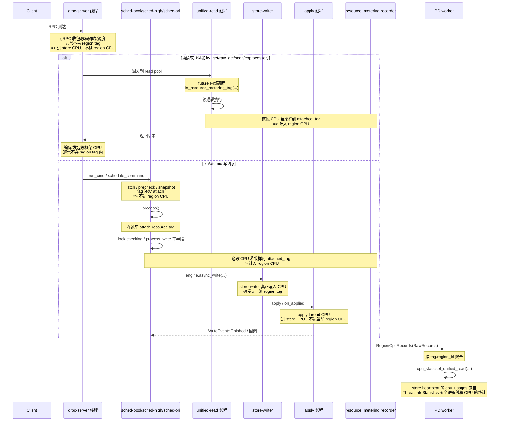

# Region CPU：问题 1 / 2 说明与时序图

这份文档回答两个问题：

1. 如果额外给不同线程池打 tag，再按线程池筛选 `region` 级 CPU，它们之和是否会和 `store` 级 CPU 上报吻合？
2. “当前 write path 的 CPU 只大致覆盖 lock checking 等写路径中的读负载，并不代表完整写 CPU” 这句话到底是什么意思？

## 前提说明

当前 TiKV 内置的 `TagInfos` 只有：

- `store_id`
- `region_id`
- `peer_id`
- `key_ranges`
- `extra_attachment`

见 `components/resource_metering/src/lib.rs:296`。

也就是说，**当前实现并没有原生的“线程池维度 region tag”字段**。下面讨论“按线程池筛选 region CPU”时，默认你的意思是：

- 你额外改了 tag，把线程池信息放进 `extra_attachment`，或者
- 你在分析时，想把某一批 region CPU 记录人为映射到某个线程池。

## 问题 1

### 结论

**通常不会完全吻合。**

如果你把 region CPU 再细分到线程池维度，那么：

- 同一线程池下，`sum(region_cpu_by_pool)` 往往只会接近、但不会严格等于 `store_cpu_usage(pool)`；
- 更常见的关系是：`region CPU <= store CPU`；
- 不吻合的原因不是只有一个，而是“口径不同 + 覆盖边界不同 + 采样方式不同”同时存在。

## 为什么不会吻合

### 1) `store` 级 CPU 的口径更大：它统计整个 TiKV 进程的线程 CPU

`store` 级 CPU 来自 `ThreadInfoStatistics`：

- 它定时扫描当前进程的所有 tid；
- 取每个 tid 的线程 CPU；
- 再按线程名聚合成 `HashMap<String, u64>`；
- 最后放进 PD `StoreStats.cpu_usages`。

关键代码：

- `components/tikv_util/src/metrics/threads_linux.rs:353`
- `components/tikv_util/src/metrics/threads_linux.rs:410`
- `components/tikv_util/src/metrics/threads_linux.rs:279`
- `components/raftstore/src/store/worker/pd.rs:817`
- `components/raftstore/src/store/worker/pd.rs:1404`

这意味着 `store` 级 CPU 本质上是：

> “这个 TiKV 进程里，某个线程名/线程池名对应的全部 CPU”

而不关心这些 CPU 是否属于某个 region。

### 2) `region` 级 CPU 的口径更小：只统计“采样时线程上挂着 tag 的 CPU”

`region` 级 CPU 来自 `resource_metering::CpuRecorder`：

- 线程只有在执行 `.in_resource_metering_tag(...)` 包裹的 future/stream 时，才会 attach tag；
- `CpuRecorder` 定时读取线程 CPU；
- 只有当前线程存在 `attached_tag` 时，才把自上次采样以来的 CPU delta 记到这个 tag 上。

关键代码：

- `components/resource_metering/src/lib.rs:76`
- `components/resource_metering/src/lib.rs:208`
- `components/resource_metering/src/recorder/sub_recorder/cpu.rs:31`
- `components/raftstore/src/store/worker/pd.rs:2052`
- `components/raftstore/src/store/worker/pd.rs:2297`

所以 `region` 级 CPU 的口径更像：

> “当前线程在某段被 tag 包住的业务执行期间，被归因到某个 region 的 CPU”

这天然比 `store` 级 CPU 小。

## 具体会漏掉哪些 CPU

### A. 同一线程池里未打 tag 的框架/执行器开销

即使线程属于你关心的线程池，只要这段 CPU 发生时线程没有 attach region tag，就不会进入 region CPU。

典型包括：

- executor/poller 自身调度开销；
- gRPC 框架层的收包、解码、编码、发包；
- 某些 callback / wakeup / timer 任务；
- 同线程池里的非 region 请求、管理任务。

这部分 CPU 会出现在 `store_cpu_usages` 中，但不会出现在 `region_cpu_records` 中。

### B. `TxnScheduler` 在 `process()` 之前的 CPU

这是第一个比较大的缺口。

txn 命令进入 scheduler 后，会先经历：

- `run_cmd`
- `schedule_command`
- latch acquire / wait
- `fail_fast_or_check_deadline`
- `kv::snapshot(...)`

而真正 attach `resource_tag` 是在 `TxnScheduler::process()` 里才开始：

- `src/storage/txn/scheduler.rs:525`
- `src/storage/txn/scheduler.rs:564`
- `src/storage/txn/scheduler.rs:608`
- `src/storage/txn/scheduler.rs:719`
- `src/storage/txn/scheduler.rs:1236`
- `src/storage/txn/scheduler.rs:1241`
- `src/storage/txn/scheduler.rs:1288`

所以对 `sched-pool` / `sched-high` / `sched-pri` 这类线程池来说，以下 CPU 不在当前 region CPU 覆盖里：

- latch 竞争与等待后的调度开销；
- precheck；
- snapshot 获取；
- 进入 `process()` 之前的框架逻辑。

### C. write path 下游线程的 CPU：`store-writer` / `apply` / raftstore

这是第二个更大的缺口。

在 `process_write()` 里，当前线程只负责：

- 基于 snapshot 做校验和生成 `WriteResult`；
- 然后调用 `engine.async_write(...)` 把后续工作交给存储引擎/raftstore；
- `on_applied` 回调注释还明确提到了 apply thread。

关键代码：

- `src/storage/txn/scheduler.rs:1864`
- `src/storage/txn/scheduler.rs:1889`
- `src/storage/txn/scheduler.rs:1643`
- `src/storage/txn/scheduler.rs:1727`
- `src/storage/txn/scheduler.rs:1730`
- `src/storage/txn/scheduler.rs:1750`
- `src/storage/mod.rs:3597`
- `components/tikv_util/src/thread_name_prefix.rs:112`
- `components/tikv_util/src/thread_name_prefix.rs:120`

因此真正重的写 CPU 很多发生在：

- `store-writer`
- `apply`
- raftstore 相关线程

这些线程的 CPU：

- 会进入 `store_cpu_usages`；
- 但不会自动继承 scheduler 上的 `ResourceMeteringTag`；
- 所以不会被当前 region CPU 模型完整统计到。

### D. 根本没走 `in_resource_metering_tag(...)` 的路径

这部分不是“线程池内部漏”，而是“整条路径不在当前 region CPU 模型内”。

典型路径：

- 普通 raw write：`raw_put/raw_batch_put/raw_delete/raw_batch_delete/raw_delete_range`
- `delete_range`
- `update_txn_status_cache`

关键代码：

- `src/storage/mod.rs:1922`
- `src/storage/mod.rs:2387`
- `src/storage/mod.rs:2495`
- `src/storage/mod.rs:2573`
- `src/storage/mod.rs:2630`
- `src/storage/mod.rs:3355`

### E. 采样窗口导致的统计误差

这里还有一个“分摊不精确”的问题。

从 `CpuRecorder` 实现可以推断：

- 一次 tick 只读取“当前 attached_tag”；
- 然后把“自上次采样以来的整段 CPU delta”全部记到这个 tag 上。

见 `components/resource_metering/src/recorder/sub_recorder/cpu.rs:31`。

因此可以推断出：

> 如果一个线程在两个采样点之间执行过多个不同 tag 的请求，那么这段 CPU 不会被精确切分到每个 tag，而是会偏向采样时当前挂着的 tag。

这是**根据实现推导出的结论**，不是注释里的原话。

它通常不会让总量无限放大，但会让“按 region / 按线程池的细分结果”进一步不精确。

## 按线程池看：哪些最容易不匹配

| 线程池/线程名前缀 | `store` 级 CPU 是否有 | 当前 `region` 级 CPU 是否容易覆盖 | 主要漏项 |
|---|---|---|---|
| `grpc-server` | 有 | 很难完整覆盖 | gRPC poll、编解码、收发包、batch mux 等大量框架 CPU 无 region tag |
| `unified-read` | 有 | 相对最接近 | executor 自身开销、采样窗口误差、未 attach tag 的任务 |
| `sched-pool` / `sched-high` / `sched-pri` | 有 | 部分覆盖 | latch / precheck / snapshot 在 tag attach 前，写后半段又下沉到别的线程 |
| `store-writer` | 有 | 基本不覆盖 | async write 后的真实写入 CPU 不继承上游 tag |
| `apply` | 有 | 基本不覆盖 | apply thread CPU 不在当前 region metering 链路里 |
| 其他后台线程 | 有 | 基本不覆盖 | 本来就不是 external RPC region CPU 口径 |

## 可以怎么理解问题 1

如果你比较的是：

> “同一个线程池内、所有 region CPU 求和”  
> vs  
> “`store_cpu_usages` 里这个线程池名对应的 CPU”

那么答案是：

> **不应期待严格相等。**

更准确的理解是：

> `region CPU` 只是 `store CPU` 中那部分“被当前 metering/tag 模型成功覆盖并归因到 region 的 CPU”。

---

## 问题 2

### 结论

这句注释基本是真的，而且它表达的重点是：

> **当前 write path 的 region CPU 归因整体不完整。**

但如果你进一步追问“是不是 scheduler CPU 也有没收集到的”，答案也是：

> **有。**

所以更准确的说法是：

- 不是只有 scheduler 漏了一点；
- 而是 write path 从前到后有多段 CPU 都没有被当前 region CPU 模型完整覆盖；
- 其中 scheduler 前半段是一个缺口，异步写入后的下游线程又是另一个更大的缺口。

### 为什么说“写路径不完整”是对的

PD worker 自己已经写了注释：

- CPU records 只来自 outside RPC workloads；
- internal TiKV CPU 不包括；
- write path 当前只算了 lock checking 等偏读负载；
- TODO 里也说需要更准确的 per-region CPU。

见 `components/raftstore/src/store/worker/pd.rs:2046`。

因此这句注释的主语其实是：

> **“当前整条 write path 的 region CPU 统计模型”**

而不只是某个单独函数。

### 但 scheduler CPU 的确也有没收集到的

tag attach 发生在：

- `TxnScheduler::process()`

之前的这些阶段不在 tag 覆盖范围里：

- `run_cmd`
- `schedule_command`
- latch acquire / wait
- `fail_fast_or_check_deadline`
- `snapshot`

见：

- `src/storage/txn/scheduler.rs:525`
- `src/storage/txn/scheduler.rs:564`
- `src/storage/txn/scheduler.rs:608`
- `src/storage/txn/scheduler.rs:719`
- `src/storage/txn/scheduler.rs:1241`

所以如果你问：

> “是不是 scheduler CPU 也存在没有收集到的？”

答案是：

> **是，存在。**

### 但更大的问题在 scheduler 之后

即使从 `process_write()` 开始已经 attach 了 tag，后面真正的写入执行会下沉到：

- `engine.async_write(...)`
- `store-writer`
- `apply`
- raftstore 相关线程

而这些阶段不会自动延续上游 scheduler 线程上的 tag。

所以如果你问：

> “注释到底是在说写路径不完整，还是 scheduler CPU 没收集到？”

更准确的回答是：

> **两者都对，但重点是“写路径整体不完整”；scheduler 前半段漏采只是其中一部分。**

---

## 时序图

下面这张图把“哪些 CPU 当前会被 region metering 记到、哪些不会”画出来。

## 最后的结论

### 对问题 1

- 如果你给不同线程池额外打 tag，再按线程池汇总 region CPU，**不要期待它和 store 级同线程池 CPU 严格相等**；
- 它更像是 store CPU 的一个“已被 region metering 成功覆盖的子集”；
- 漏项主要来自：未打 tag 的框架 CPU、scheduler 前半段、async_write 后的 store-writer/apply CPU，以及根本没走 metering 的请求路径。

### 对问题 2

- “write path 不完整”这句话是真的；
- 但它不只是说“scheduler 前面漏了一点 CPU”；
- 更准确地说，是**当前整条 write path 的 region CPU 归因模型不完整**；
- 其中既包括 scheduler 前半段未 attach tag，也包括 async write 之后下游线程的大量 CPU 没被继续归因。
